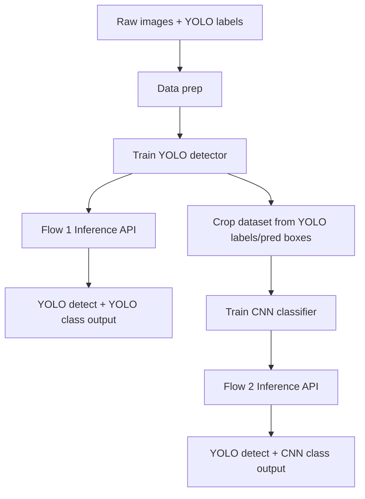

# Project Flow - Vietnamese Traffic Sign Recognition

Muc tieu tai lieu nay: dinh nghia ro 2 luong pipeline de implement, tranh nham thanh mot luong duy nhat.

## Nguyen tac tach bach bat buoc

- Luong 1 la: `YOLO detect + YOLO du doan` (mot model YOLO thuc hien ca detect va classify class bien bao).
- Luong 2 la: `YOLO detect + CNN du doan` (YOLO chi dung de lay bbox, class cuoi cung do CNN quyet dinh).
- Hai luong co the dung chung mot detector YOLO, nhung **logic du doan cuoi** phai tach rieng.
- Trong code, khong duoc de suy luan "neu co CNN thi thay class YOLO ngay trong luong 1". Moi luong la mot API/doc lap.

---

## Tong quan Kien truc



---

## Luong 1: YOLO detect + YOLO du doan

### 1) Train

1. Chuan hoa dataset detection theo format YOLO:
   - `images/train`, `images/val`, `images/test`
   - `labels/train`, `labels/val`, `labels/test`
   - `data.yaml` (names = 52 class).
2. Train YOLOv8n detector:
   - Dau vao: anh full scene + bbox + class.
   - Dau ra model: `artifacts/yolo_detect_cls/best.pt`.
3. Danh gia:
   - mAP50-95, Precision, Recall, FPS, model size.

### 2) Inference

1. Input anh/video frame.
2. YOLO predict -> tra ve danh sach object:
   - bbox `(x1,y1,x2,y2)`
   - `class_id_yolo`
   - `class_name_yolo`
   - `confidence_yolo`
3. Render ket qua truc tiep tu YOLO.

### 3) Output contract (Flow 1)

```json
{
  "flow": "flow1_yolo_yolo",
  "detections": [
    {
      "bbox": [100, 120, 180, 210],
      "class_id": 7,
      "class_name": "cam_re_trai",
      "confidence": 0.92,
      "source": "yolo"
    }
  ]
}
```

---

## Luong 2: YOLO detect + CNN du doan

### 1) Train

1. Tai su dung detector YOLO (co the dung model tu Luong 1 hoac train rieng detector).
2. Tao du lieu cho CNN:
   - Crop tung bien bao tu anh theo bbox (uu tien bbox ground-truth de train CNN).
   - Luu theo cau truc classification:
     - `crops/train/<class_name>/*.jpg`
     - `crops/val/<class_name>/*.jpg`
     - `crops/test/<class_name>/*.jpg`
3. Train CNN classifier (ResNet/EfficientNet):
   - Dau vao: crop image.
   - Dau ra model: `artifacts/cnn_classifier/best.pth`.
4. Danh gia classifier:
   - Accuracy, F1-macro, confusion matrix, inference latency.

### 2) Inference

1. Input anh/video frame.
2. YOLO detector tra bbox (chi dung cho localize object).
3. Cat tung crop theo bbox.
4. Chuan hoa crop -> dua vao CNN.
5. CNN predict class cuoi:
   - `class_id_cnn`, `class_name_cnn`, `confidence_cnn`.
6. Tra ket qua bbox tu YOLO + nhan tu CNN.

### 3) Output contract (Flow 2)

```json
{
  "flow": "flow2_yolo_cnn",
  "detections": [
    {
      "bbox": [100, 120, 180, 210],
      "detector_confidence": 0.95,
      "class_id": 7,
      "class_name": "cam_re_trai",
      "confidence": 0.89,
      "source": {
        "bbox": "yolo",
        "class": "cnn"
      }
    }
  ]
}
```

---

## So sanh dung nghia (de tranh code sai)

- Flow 1:
  - BBox: YOLO
  - Class: YOLO
  - Ket qua cuoi: class tu YOLO
- Flow 2:
  - BBox: YOLO
  - Class: CNN
  - Ket qua cuoi: class tu CNN

> Dieu cam ky: khong goi Flow 2 la "YOLO classify". Trong Flow 2, YOLO khong ra quyet dinh class cuoi.

---

## De xuat cau truc thu muc implement

```text
src/
  data/
    prepare_detection.py
    build_crops_for_cnn.py
  train/
    train_yolo.py
    train_cnn.py
  infer/
    infer_flow1_yolo_yolo.py
    infer_flow2_yolo_cnn.py
  pipelines/
    flow1_pipeline.py
    flow2_pipeline.py
  common/
    labels.py
    image_ops.py
    postprocess.py
artifacts/
  yolo_detect_cls/
  cnn_classifier/
configs/
  yolo.yaml
  cnn.yaml
  infer.yaml
```

---

## API/CLI de chay dung 2 luong

- Flow 1:
  - `python -m src.infer.infer_flow1_yolo_yolo --input path_or_video`
- Flow 2:
  - `python -m src.infer.infer_flow2_yolo_cnn --input path_or_video`

Khuyen nghi:
- Tach endpoint:
  - `POST /predict/flow1`
  - `POST /predict/flow2`
- Moi endpoint log ro `flow_id` de tranh nham ket qua benchmark.

---

## Checklist truoc khi bat dau code/train

- [ ] Co `class_map` dung chung cho YOLO va CNN (id <-> ten class).
- [ ] Co script crop dataset cho CNN va da verify class distribution.
- [ ] Co 2 file infer rieng, khong dung chung mot ham "predict class" cho ca 2 luong.
- [ ] Co benchmark script xuat ket qua theo `flow1` va `flow2` tach biet.
- [ ] Bao cao cuoi co bang so sanh dung cap:
      `YOLO end-to-end` vs `YOLO+CNN hybrid`.
